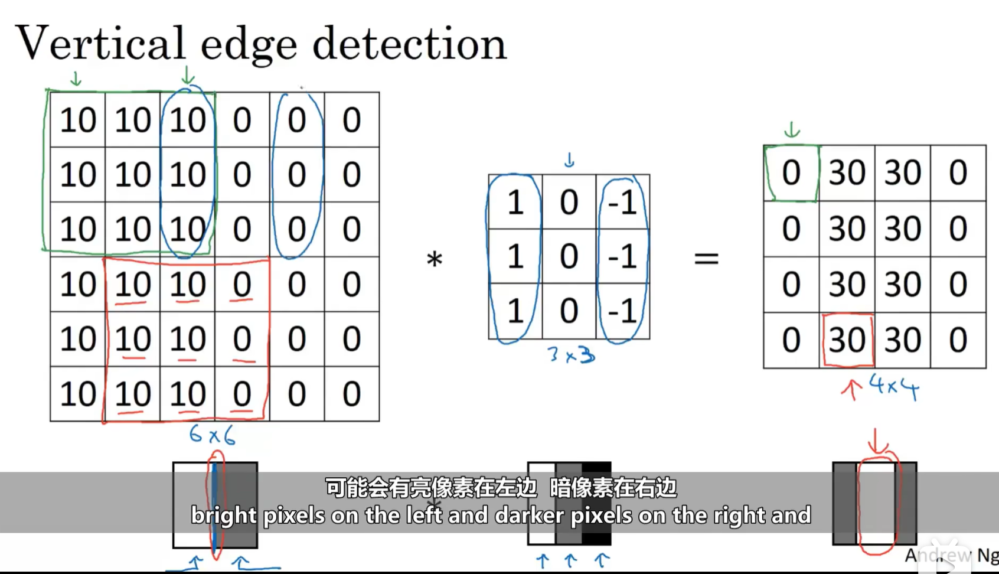

# Edge Detection

Edge detection can be performed using convolution. A filter (also known as a kernel) is used to convolve an image.

In this context, `*` is the typical symbol for convolution.

### Convolution Operation

For each pixel in the image, the convolution operation computes the sum of the element-wise multiplication between the image region and the filter:
\[
\text{output}(i,j) = \sum_{m,n} \text{image}(i+m, j+n) * \text{kernel}(m,n)
\]

### Example Code Snippet

In deep learning frameworks like TensorFlow and Keras, convolution can be performed using built-in functions:

- **TensorFlow**: `tf.nn.conv2d`
- **Keras**: `Conv2D`

Below is an illustration of edge detection using a vertical edge detection filter:


By applying a convolution filter, edges can be detected in an image. Different filters (such as Sobel or Prewitt filters) can be used to detect horizontal, vertical, or diagonal edges.

### Python Implementation Example

```python
import tensorflow as tf
from tensorflow.keras.layers import Conv2D
import numpy as np

# Example of applying a convolution filter to detect edges
image = np.array([[...]])  # Replace with your image data
kernel = np.array([[1, 0, -1],
                   [1, 0, -1],
                   [1, 0, -1]])  # Vertical edge detection filter

# Convert the image to a 4D tensor for TensorFlow (batch, height, width, channels)
image = image.reshape((1, image.shape[0], image.shape[1], 1))
kernel = kernel.reshape((3, 3, 1, 1))

# Perform the convolution operation
output = tf.nn.conv2d(image, kernel, strides=[1, 1, 1, 1], padding='VALID')

print(output)
