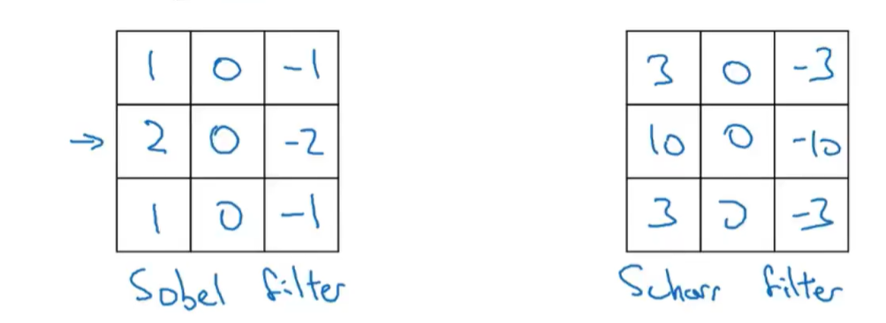

# 1.Edge Detection

Edge detection can be performed using convolution. A filter (also known as a kernel) is used to convolve an image.

In this context, `*` is the typical symbol for convolution.

### 1.1 Convolution Operation

For each pixel in the image, the convolution operation computes the sum of the element-wise multiplication between the image region and the filter:
\[
\text{output}(i,j) = \sum_{m,n} \text{image}(i+m, j+n) * \text{kernel}(m,n)
\]

### Example Code Snippet

In deep learning frameworks like TensorFlow and Keras, convolution can be performed using built-in functions:

- **TensorFlow**: `tf.nn.conv2d`
- **Keras**: `Conv2D`

Below is an illustration of edge detection using a vertical edge detection filter:


By applying a convolution filter, edges can be detected in an image. Different filters (such as Sobel or Prewitt filters) can be used to detect horizontal, vertical, or diagonal edges.

### Python Implementation Example

```python
import tensorflow as tf
from tensorflow.keras.layers import Conv2D
import numpy as np

# Example of applying a convolution filter to detect edges
image = np.array([[...]])  # Replace with your image data
kernel = np.array([[1, 0, -1],
                   [1, 0, -1],
                   [1, 0, -1]])  # Vertical edge detection filter

# Convert the image to a 4D tensor for TensorFlow (batch, height, width, channels)
image = image.reshape((1, image.shape[0], image.shape[1], 1))
kernel = kernel.reshape((3, 3, 1, 1))

# Perform the convolution operation
output = tf.nn.conv2d(image, kernel, strides=[1, 1, 1, 1], padding='VALID')

print(output)
```
### 1.2 other kinds of filter：
- **sobel filter**
- **scharr filter**

can also make the machine learn the 9 parameters itself.

Below is an illustration of those different filter:


### 1.3 padding
to avoid getting a very small image and throwing away a lot of the information from the edges of the image, we can pad the image.

after padding, the length of edge may become ( n + 2*p - f + 1) ^ 2 from (n - f + 1) ^ 2

same convolutions: p = (f - 1)/2, so f usually be an odd.

### 1.4 Strided convolution
(stride = 2, [(n + 2*p - f) / s + 1] ;
 
### 1.5  multidimentioal convolution  
n * n * n_c convolution with f * f * f = (n - f + 1) * (n - f + 1) * n_fliter_number

n_c is also known as depth or channel

Below is an illustration of a multidimentioal convolution  filter:

